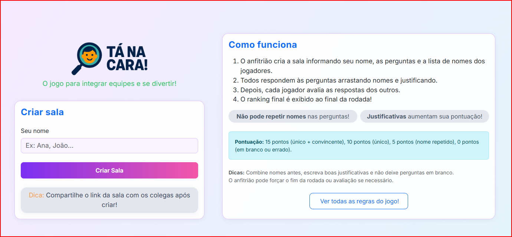
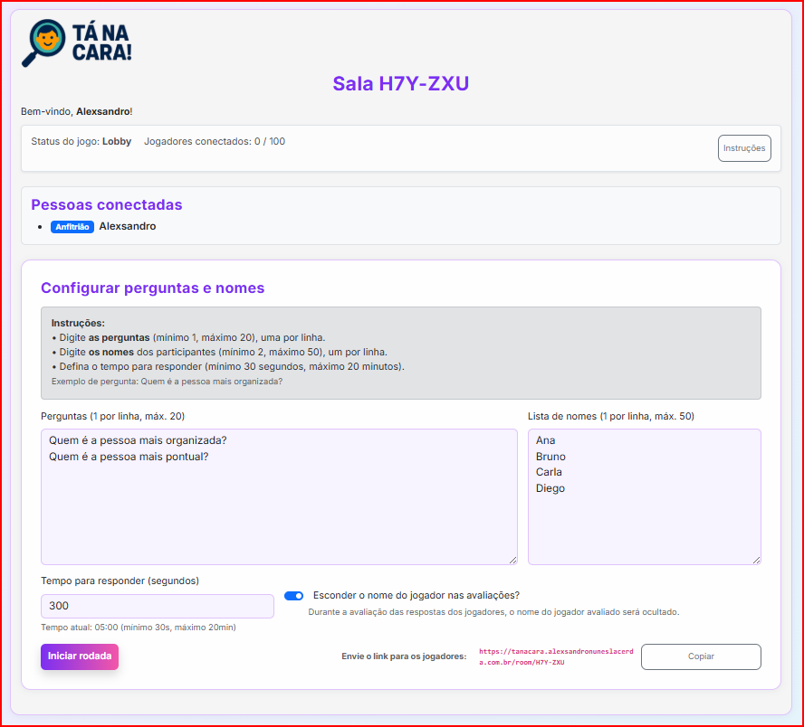
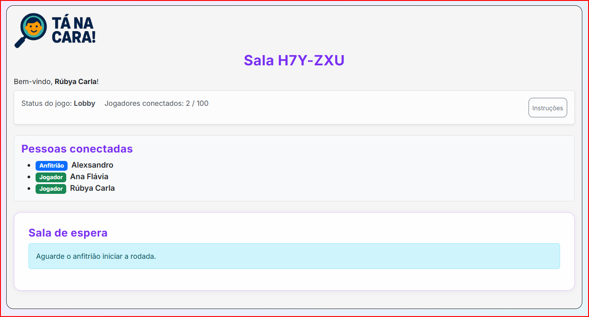
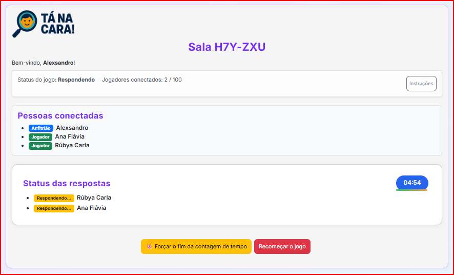
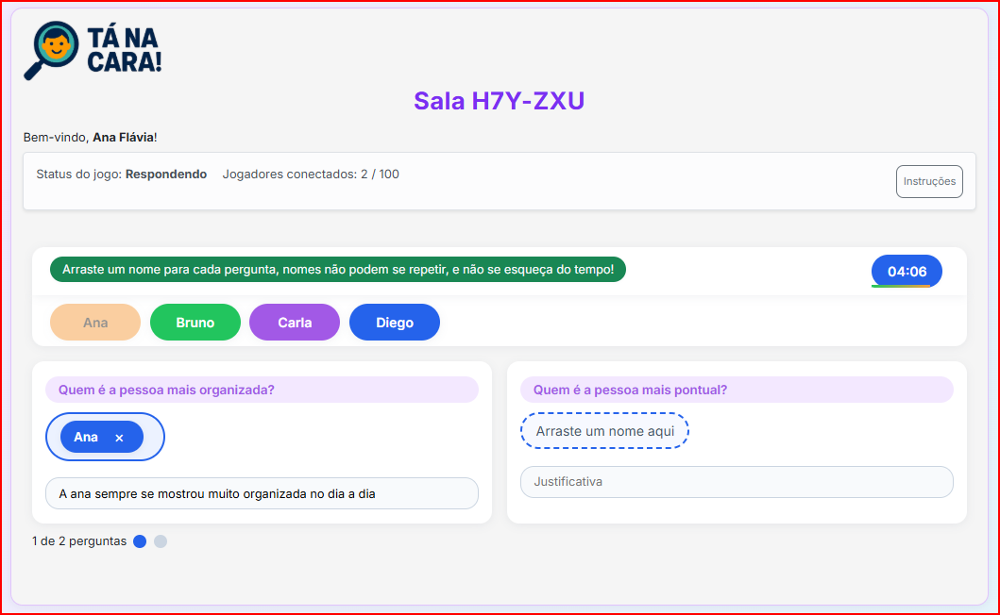
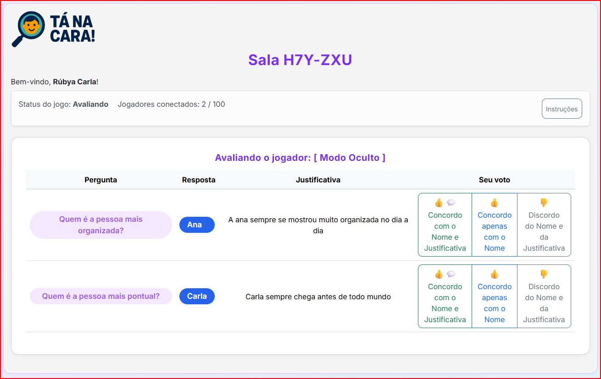
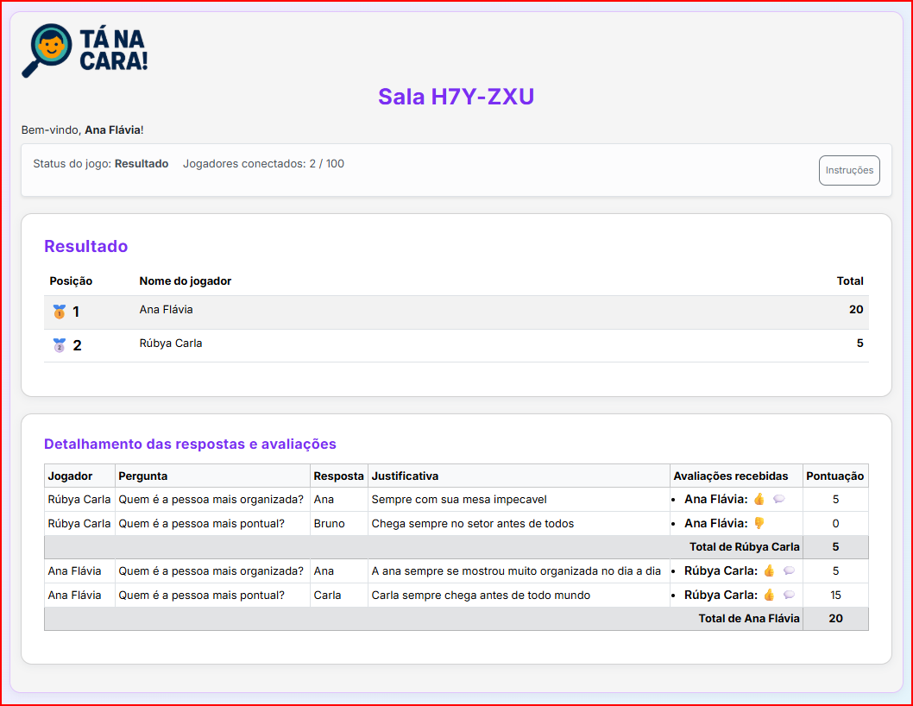

# 🎉 Tá na Cara! – Multiplayer de Integração Social entre Equipes

> **👉 Quer jogar agora mesmo?**  
> 🔗 Teste online: [https://tanacara.alexsandronuneslacerda.com.br](https://tanacara.alexsandronuneslacerda.com.br)

---

## 🕹️ O que é?
O **Tá na Cara!** é um jogo social e divertido para **times, amigos e eventos online**.  
A dinâmica é simples: arraste nomes, justifique suas escolhas, avalie os outros e descubra quem conhece melhor o grupo.  

💫 Inspirado em uma dinâminca na Hyti **(Agradecimento ao Paulo e a Jaqueline)**

✨ **Diversão garantida + integração rápida + interface moderna**  

💡 Pode ser usado em diversos contextos, como:  
- **Momentos de descontração promovidos por times de RH / Gente & Cultura** para fortalecer o clima organizacional.  
- **Dinâmicas de integração** em workshops, treinamentos e onboarding de novos colaboradores.  
- **Quebra-gelos divertidos** em reuniões remotas ou presenciais.  
- **Atividades sociais e de lazer** com amigos, familiares ou comunidades online.  
- **Eventos corporativos ou acadêmicos** que precisem de uma experiência leve e interativa.  

---



---

## 🚀 Como rodar em segundos (via Docker)

1. **Puxe a imagem mais recente**
```sh
docker pull alexsandronuneslacerda/tanacara:latest
```

2. **Execute na sua máquina**
```sh
docker run -d -p 7072:7072 alexsandronuneslacerda/tanacara:latest
```

3. **Abra no navegador**
```
http://localhost:7072
```

💡 Pronto! Sem banco de dados, sem configuração complexa — tudo em memória.

---

## 📖 Regras rápidas do jogo

- 👤 O **anfitrião cria a sala** com perguntas e lista de nomes.  
- 🎯 Cada jogador arrasta **um nome único** para cada pergunta e adiciona justificativa.  
- 🔄 Ao terminar, todos avaliam as respostas dos colegas.  
- 🏆 Pontuação:  
  - **15 pts** → nome único + justificativa convincente  
  - **10 pts** → nome único  
  - **5 pts** → nome repetido  
  - **0 pts** → em branco ou errado  
- 📊 Ranking final exibe quem mandou melhor.  

---

## 💡 Por que jogar?

✔ Integração descontraída para equipes  
✔ Ótimo quebra-gelo em workshops e eventos  
✔ Interface leve, responsiva e intuitiva  
✔ Funciona totalmente em memória  

---

## 🛠️ Requisitos

- [Docker Desktop](https://www.docker.com/products/docker-desktop/) instalado na sua máquina

---

## 📸 Galeria de Prints

<div align="center">
  
  
  <br/>
  
  
  
</div>

---

## 🧑‍💻 Tecnologias utilizadas

- **.NET 9** (Blazor Server)
- **C#**
- **Bootstrap 5**
- **Blazored.LocalStorage**
- **Docker**

---

## 🧩 Técnicas e padrões utilizados

- **Componentização com Blazor**: UI dividida em componentes reutilizáveis.
- **EventCallback e Data Binding**: Comunicação eficiente entre componentes e atualização reativa da interface.
- **Injeção de Dependência**: Serviços como navegação, storage e lógica de jogo injetados via DI.
- **Singleton para estado em memória**: Todas as salas e dados do jogo são mantidos em memória, sem banco de dados.
- **Timer centralizado no servidor**: Controle de tempo das rodadas feito no backend, garantindo sincronização para todos.
- **Responsividade com Bootstrap**: Layout adaptável para desktop e mobile.
- **Validação e feedbacks em tempo real**: Mensagens de erro e sucesso exibidas instantaneamente ao usuário.
- **Padrão Service Layer**: Lógica de negócio separada em serviços (ex: GameService, ScoringService).

---

## 📜 Licença & Autor

© **Tá na Cara!** – Desenvolvido por **Alexsandro Nunes Lacerda**  
- 📸 **Instagram**: [@alexsandronl](https://instagram.com/alexsandronl)  
- 💼 **LinkedIn**: [alexsandronuneslacerda](https://www.linkedin.com/in/alexsandronuneslacerda)  
- 🌐 **Site/Blog**: [alexsandronuneslacerda.com.br](https://www.alexsandronuneslacerda.com.br) (beta)

Distribuído sob licença **MIT**

---

## ⭐ Contribua

Gostou da ideia?  
- Dê uma **estrela** ⭐ no repositório  
- Compartilhe com sua equipe ou amigos  
- Abra **issues** com ideias e melhorias  

> **Sua participação ajuda o jogo a crescer e se tornar ainda mais divertido!** 🎉

